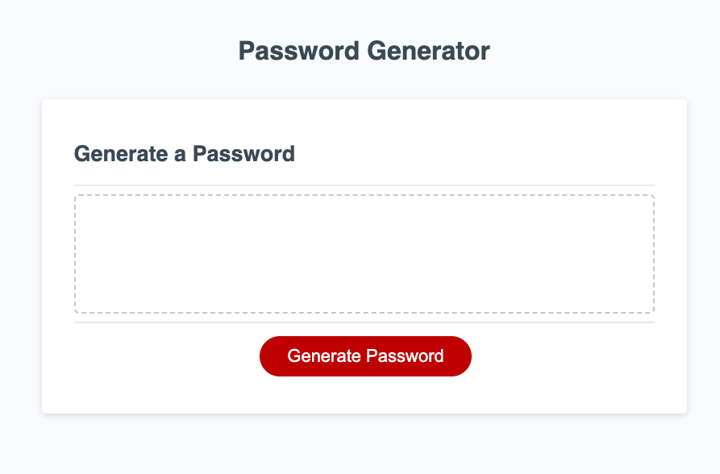

# Password Generator

## Description

The purpose of this application is to allow users to generate random passwords in order to ensure their login information is secure. The webpage consists of a "Generate Password" button, window prompts that ask the user for their password criteria, and a text box where the generated password appears.

## Installation

N/A

## Usage

To use this webpage, click on the "Generate Password" button and answer the prompts. When you have answered the last prompt, a password will appear in the text box.

## Credits

Source for randomLength function code: MDN https://developer.mozilla.org/en-US/docs/Web/JavaScript/Reference/Global_Objects/Math
Source for generateString function code: https://www.programiz.com/javascript/examples/generate-random-strings

## Link

https://elisestankus.github.io/password-generator/

## Screenshot

